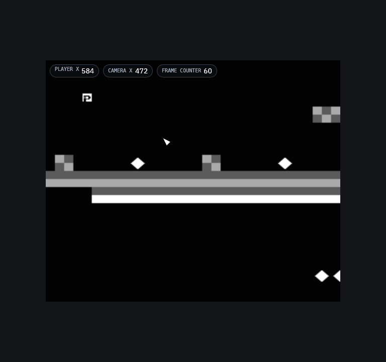

# RetroForge

A hybrid **NES + SNES emulator and enhancement platform**: accurate,
deterministic emulation cores under one frontend, plus an opt-in enhancement
engine — no sprite dropout or flicker, widescreen, stitched and decoded
level maps, 3D dioramas, shaders, rewind, Lua scripting, and live game info.



## For players

- **Your own games.** Point the library at your folders of `.nes`, `.sfc`,
  `.smc`, `.fig` or `.zip` files. No ROM data lives in or ships with this repo.
- **Three modes per game.** *Original* (exactly what the console drew, the
  default), *Enhanced* (fixes that work on any game), *Game-Aware* (uses the
  game's profile for widescreen, level maps, skipping loads and 3D).
- **About 65 game profiles included** — the Mario, Zelda, Metroid, Contra,
  Castlevania and Mega Man series and more — with cameras verified by
  playing each dump and items (lives, health, coins…) cited from community
  RAM maps.
- **No profile? RetroForge finds the camera while you play**, or the
  profile builder walks you through finding addresses by hand.
- **Game info**: pin lives, health, rupees, missiles and more as chips over
  the game.
- Quick Menu on **Esc**: ten save-state slots with pictures, rewind,
  display and shaders, controls for keyboard and controller.

User guide and screenshot tour: [`docs/site`](docs/site/src/SUMMARY.md)
(build it with `mdbook serve docs/site`).

**Status** (2026-10-09, v0.9.1): **332 of 340 tickets done, 7 blocked, 1 todo.**
The boot census on a local No-Intro library renders **1233 of 1265 SNES**
archives and **1234 of 1281 NES**. Releases are built for **macOS, Windows and
Linux** by `.github/workflows/release.yml`; the Windows and Linux builds are
compiled by CI and have not yet been run on hardware by the project.
Graphics run on Vulkan, DirectX 12, Metal or OpenGL (Settings › Video). **Every green
claim in this repo rests on the local gate on one darwin machine**: hosted
CI has not run since ~2026-08-07 and, by ruling, will not run again
(`CLAUDE.md` → Build). See `docs/STATUS.md`.

## Principles

- Baseline mode = original hardware behavior, always. Enhancements are
  opt-in, reversible, and can never perturb the simulation — enforced by
  the `mode_invariant_5k` / `mode_invariant_corpus` tests in the local
  gate, not by CI (see `docs/TESTING.md` §0).
- Honesty about limits: generic tricks (scaling, de-flicker, wideNES-style
  map stitching) work everywhere; full-level/widescreen reconstruction
  requires per-game profiles. See docs/ARCHITECTURE.md §2.
- Bring your own ROMs. No ROM data lives in or ships with this repo.

## Getting started (contributors / coding agents)

```
cargo test --workspace        # builds + tests all 16 crates
```

Read `MASTER_PROMPT.md` → `plan.json` → `PLAYBOOK.md`. Architecture:
`docs/ARCHITECTURE.md`. Research basis (verified July 2026): `docs/research/`.
Profile tooling: `scripts/profile-census.py`, `scripts/profile-items.py`
(with `crates/rf-harness/tests/profile_census.rs`).

## License

MIT OR Apache-2.0 (code). Game profiles under `/profiles` are facts +
citations, same license. No third-party ROM content.
