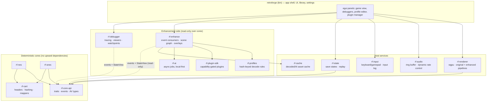

# RetroForge — System Architecture (SAD)

Status: Phase 3 baseline · 2026-07-06 · Owner: principal engineer
Companion deep-dives live in `docs/design/`. Tickets in `plan.json` trace to
section numbers here.

## 1. Executive summary

RetroForge is a retro game **enhancement platform** built on top of accurate
NES and SNES emulation. It is two systems with a strict one-way boundary:

1. **Emulation cores** — deterministic, cycle-driven machines that run
   user-provided ROMs exactly as original hardware would. They know nothing
   about enhancements.
2. **Enhancement engine** — an observer that subscribes to core events,
   inspects core state through read-only views, and (only when the user opts
   in) overrides *presentation* — never core simulation — via the renderer.

Everything "beyond original hardware" (widescreen, de-flicker, full-level
views, AI upscaling) is emulator-side resources: bigger render targets,
decoded caches, reconstructed scene graphs. The emulated machine keeps its
original memory map and timing unless a user-enabled mod explicitly patches
it.

## 2. Honesty contract (what is generic vs per-game)

| Capability | Generic (works on any ROM) | Requires per-game profile |
|---|---|---|
| Scaling, shaders, CRT filters | ✅ | — |
| Sprite-limit bypass at render layer | ✅ (PPU-level, with per-game safety toggle) | opt-out list |
| Temporal de-flicker (alternating OAM reconstruction) | ✅ heuristic, imperfect | tuning/exclusions |
| Map stitching from observed scroll (wideNES technique) | ✅ incremental, only shows *visited* areas | — |
| Full-level render incl. unvisited areas | ❌ impossible generically | ✅ ROM level-format decoder |
| Widescreen background extension | NES: ❌ (nametables barely exceed viewport). SNES: ⚠️ semi-generic — bsnes-hd proves extra tilemap columns often already exist; artifacts (sprite pop-in, garbage tiles) without per-game policy | ✅ per-BG-layer policies, or AI outpainting (approximate) |
| HUD separation | heuristic (split-screen IRQ/HDMA detection) | ✅ for reliability |
| Loading-screen fast-forward | heuristic (idle-loop detection) is risky | ✅ known wait loops |
| Smooth scrolling beyond 60 Hz game logic | ❌ game logic updates positions once per frame; true smoothing needs interpolation of *decoded* entity positions | ✅ entity table addresses |
| Enemy/object positions for overlays | ❌ | ✅ RAM map |

Anything in the right column flows through `rf-profiles`. The platform's
value is making that column *cheap to author* (debugger → annotation →
profile export) — not pretending it is free.

## 3. Layer diagram



Dependency rule: `rf-nes`/`rf-snes` depend only on `rf-core-api` + `rf-cart`.
Nothing in `Cores` imports anything from `Enhance` or `Host`. Enforced by
`cargo deny`-style check in CI (`scripts/validate-arch.sh` greps crate
manifests).

## 4. Operating modes

Modes are *configuration presets* over the same binary, not code paths:

1. **Accuracy** — core in cycle-accurate config, enhancement runtime not
   subscribed, renderer in original pipeline. Reference for all tests.
2. **Compatibility** — core may enable documented fast paths (e.g. batched
   PPU catch-up) that pass the compatibility test suite; still deterministic.
3. **Enhanced** — enhancement runtime subscribed; user-selected features on.
4. **Research/Debug** — everything exposed: traces, viewers, breakpoints,
   frame stepping; enhancement optional.
5. **Game-Aware** — Enhanced + a matched profile; unlocks profile-gated
   features (full-level view, HUD split, entity overlays).

Invariant tested in CI: for identical ROM + input log, Accuracy and Enhanced
modes produce **identical core state hashes** every frame (enhancement cannot
perturb simulation).

## 5. Core API (`rf-core-api`)

The contract every core implements. Sketch (authoritative version lands with
ticket W0-04):

```rust
pub trait EmulatorCore {
    fn load(&mut self, cart: Cartridge) -> Result<(), CoreError>;
    fn reset(&mut self, kind: ResetKind);

    /// Run exactly one video frame. Deterministic: same state + same input
    /// => same state. The ONLY way time advances in normal operation.
    fn run_frame(&mut self, input: &InputFrame, sink: &mut dyn CoreSink);

    /// Cycle-precise stepping for the debugger.
    fn step(&mut self, granularity: Step, sink: &mut dyn CoreSink) -> StepResult;

    fn save_state(&self, w: &mut dyn StateWriter) -> Result<(), StateError>;
    fn load_state(&mut self, r: &mut dyn StateReader) -> Result<(), StateError>;

    /// Read-only, zero-copy-where-possible view of machine state for the
    /// enhancement/debug side. Valid only between frames.
    fn state_view(&self) -> StateView<'_>;

    fn config(&mut self) -> &mut CoreConfig; // accuracy/compat switches
}
```

`CoreSink` is how cores emit output and events **push-style during the
frame** (video scanlines, audio samples, and subscribed event hooks), so the
enhancement side never reaches into a running core:

```rust
pub trait CoreSink {
    fn video_scanline(&mut self, y: u16, pixels: &[PpuPixel]); // indexed + priority metadata
    fn audio(&mut self, samples: &[i16]);
    fn event(&mut self, ev: CoreEvent); // FrameStart/End, VblankStart, ScanlineN,
                                        // OamRewrite, ScrollWrite{x,y,layer},
                                        // MapperIrq, DmaStart{chan}, MemWatch{id}
}
```

Event emission is subscription-filtered: cores check a cheap bitmask before
constructing events, so Accuracy mode with no subscribers pays ~zero cost.
`StateView` exposes CPU regs, WRAM, VRAM/CGRAM/OAM, PPU regs, mapper state as
borrowed slices — read-only by construction.

Pixels cross the core boundary as **indexed color + source metadata**
(palette index, layer, sprite id, priority), not RGB. This single decision is
what makes layer extraction, HUD separation, de-flicker, and palette-aware AI
upscaling possible without heuristics on RGB output.

## 6. Determinism model

- One **core thread** runs `run_frame` in a loop; cores are single-threaded
  internally (interleaved CPU/PPU/APU catch-up scheduling, Mesen-style; see
  `docs/design/EMULATION_CORES.md`). No wall-clock reads inside cores; RNG
  doesn't exist in hardware, so none in cores.
- Input is latched per frame into `InputFrame` and logged (`rf-state` replay
  log). Replay = same ROM hash + same initial state + input log.
- Everything else — render post-processing, shader compile, audio resample,
  AI jobs, decode/stitch work, trace processing, save-state compression —
  runs on host worker threads fed by frame events. Workers may lag; they can
  never write back into a core. Cross-thread handoff is a triple-buffered
  `FrameBundle { video, audio, events, state_snapshot_refs }`.
- CI determinism test: run N frames twice from the same state with the same
  input log, compare full state hash per frame; also replay-from-log on every
  test ROM.

## 7. Module-by-module responsibilities

| Crate | Owns | Must not |
|---|---|---|
| `rf-core-api` | traits above, `CoreEvent`, `StateView`, AV types | depend on any other rf-crate |
| `rf-cart` | iNES/NES2.0/SNES header parse, normalization + CRC32/MD5/SHA-1/SHA-256 (RA/No-Intro-compatible, see `docs/research/game-identity-and-re-data.md`), mapper/chip detection, SRAM files | know about profiles |
| `rf-nes` | 2A03 (6502 + APU) cycle-stepped, PPU with per-dot rendering, mappers NROM→MMC1→UxROM→CNROM→MMC3 | import renderer/enhance |
| `rf-snes` | 5A22 (65C816 + DMA/HDMA), PPU1/2 (modes 0-7, windows, mosaic, color math), S-SMP/S-DSP, LoROM/HiROM | import renderer/enhance |
| `rf-renderer` | wgpu device mgmt, original pipeline (indexed→RGB→scale), enhanced pipeline (layered composition, shader chains, big framebuffers), side-by-side view | mutate core state |
| `rf-audio` | cpal stream, SPSC ring, dynamic rate control (±0.5% resample against buffer fill) | block core thread |
| `rf-input` | winit keyboard + gilrs pads, remapping, `InputFrame` latch, input log | — |
| `rf-enhance` | event bus, OAM history + de-flicker, scroll tracker + map stitcher (generic wideNES-style), scene graph, overlay registry, profile-driven decoders' host | write core memory (except via explicit user-enabled patch API) |
| `rf-profiles` | schema (see `docs/design/GAME_PROFILES.md`), loader, hash match, versioning, validation | executable code (data only; code = plugins) |
| `rf-plugin-sdk` | capability-declared plugin traits; native-trait plugins now, WASM host later | grant write caps silently |
| `rf-debugger` | breakpoints/watchpoints via core `step`, trace ring buffers, data providers for pattern/nametable/OAM/palette/tilemap/Mode7 viewers, annotation store (exports to profile) | — |
| `rf-state` | container format (versioned TLV chunks per crate), zstd, replay logs, rewind ring later | — |
| `rf-cache` | content-addressed store keyed `(rom_sha256, asset_hash, producer, settings_hash)` | — |
| `rf-ai` | async job queue + trait `Enhancer { fn enhance(job) -> CacheEntry }`; local ONNX first, cloud optional later | be required at runtime |
| `rf-harness` | headless runner, test-ROM manifests, golden-frame compare, state-hash determinism checks | — |
| `retroforge` (bin) | egui shell, library, per-game settings, mode toggles, panel docking | contain emulation logic |

## 8. Main loop (pseudocode)

```text
loop {                                   # host frame pacing via audio clock
    input_frame = input.latch()          # also appended to replay log
    core.run_frame(input_frame, sink)    # deterministic; emits scanlines/samples/events
    bundle = sink.take_bundle()

    audio.push(bundle.samples)           # ring buffer; rate control adjusts resampler

    if enhancement.enabled {
        enhancement.on_frame(&bundle, core.state_view())
        #   - update OAM history, flicker sets
        #   - update scroll tracker / stitched map
        #   - run profile decoders on dirty regions
        #   - rebuild scene graph deltas
        #   - collect plugin overlay commands
        scene = enhancement.compose_scene()
        renderer.render_enhanced(scene, bundle.video)   # layered, big FB, ultrawide
    } else {
        renderer.render_original(bundle.video)          # 256x240/512x478 → scale
    }

    debugger.ingest(&bundle)             # lock-free; drops when viewers closed
    pacing.wait_for_next_frame()         # audio-driven, vsync-aware
}
```

Enhanced rendering (per frame, render thread):

```text
render_enhanced(scene, original_frame):
    for layer in scene.layers_back_to_front():
        match layer:
            StitchedMap(tex, viewport)   -> draw region around camera (ultrawide crop)
            DecodedLevel(chunks)         -> draw visible chunks from cache
            GameBg(layer_id)             -> draw extracted BG layer (indexed→RGB LUT)
            Sprites(list)                -> draw union of de-flickered sprite set,
                                            original priority order preserved
            Hud(region)                  -> draw pinned at screen edge (profile rule)
            Overlay(cmds)                -> plugin/debug draw commands
    apply shader chain (crt / scalers / none)
    if compare_mode: blit original_frame side-by-side
```

## 9. Cross-cutting decisions

- **Language**: Rust (workspace of 16 crates, already scaffolded). Safety for
  a large long-lived codebase; `unsafe` warned by lint, allowed only in
  audited hot paths.
- **Renderer**: wgpu — one abstraction targeting Vulkan/Metal/DX12/WebGPU,
  matching the requirement without hand-writing three backends.
- **UI**: egui/eframe — immediate-mode, excellent for dockable debug tooling
  (the majority of our UI surface); proven in emulator-adjacent Rust tools.
- **Plugins**: two tiers — (a) data-only profiles, (b) code plugins compiled
  against `rf-plugin-sdk`, in-process trait objects first, WASM (wasmtime)
  sandbox when the API stabilizes (Phase 9). Capabilities are declared in a
  manifest and shown to the user; memory-write capability requires explicit
  per-plugin user enablement.
- **Save states**: chunked TLV container, each crate serializes its own
  versioned chunk; enhancement state is separate chunks so an Accuracy-mode
  build can load an Enhanced-mode state (ignoring unknown chunks). See
  `docs/design/SAVE_STATES.md`.
- **No ROMs in repo** — test ROMs fetched by manifest (URL + SHA-256) into a
  gitignored dir; homebrew demo ROMs vendored only with license files.

## 10. Risks (top 5; full register in docs/RISKS.md)

1. SNES PPU + S-DSP accuracy is a multi-quarter effort → sequence NES first,
   reuse harness; use bsnes/Mesen2 test baselines.
2. De-flicker showing intentionally-hidden sprites → per-game override +
   conservative defaults + side-by-side compare view.
3. Enhancement leaking into determinism → CI invariant (§4) from day one.
4. Scope explosion → plan.json gates: no Phase-N ticket starts before N-1
   exit criteria (docs/ROADMAP.md) pass.
5. Plugin API churn → keep SDK `0.x` and in-tree until Phase 9; only profiles
   are a stable public format early.
