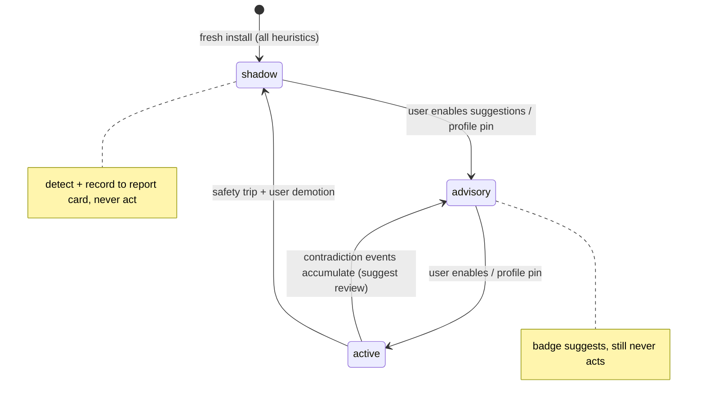

# Design: Enhancement Runtime (`rf-enhance`)

The enhancement runtime is a frame-synchronous observer of the cores plus an
asynchronous farm of decode/analysis jobs. It never mutates core state. Its
output is a **scene graph** consumed by the renderer's enhanced pipeline.

## 1. Event flow

```
core (run_frame) ──CoreSink──▶ FrameBundle ──▶ EnhancementRuntime::on_frame
                                                 ├─ SpriteHistorian      (generic)
                                                 ├─ ScrollTracker/Stitcher (generic)
                                                 ├─ ProfileDecoders      (game-aware)
                                                 ├─ PluginHost           (user-enabled)
                                                 └─ SceneComposer ──▶ SceneGraph ──▶ rf-renderer
```

Subscriptions are declared up front (`EventMask`) so cores skip emission for
unwatched events. Heavy work (level decode, stitching, AI) is posted to
worker threads; the frame-synchronous path only updates small state and
composes the scene.

## 2. Anti-flicker (generic, with per-game overrides)

Original behavior: NES PPU draws max 8 sprites/scanline (SNES: 32 sprites /
34 tile-slivers); games rotate OAM order so overflow alternates between
objects — perceived as flicker.

Two independent, separately-toggleable mechanisms:

1. **Sprite-limit bypass** (render-layer): the core still *evaluates* OAM
   exactly as hardware (sprite-0 hit and overflow flags stay correct — game
   logic depends on them), but the emitted scanline includes the sprites that
   the limit would have dropped, flagged `dropped_by_limit`. Enhanced render
   draws them; Accuracy render ignores them. This is the Mesen-proven
   approach.
2. **Temporal reconstruction** (for games that *pre-cull* in software —
   rotating which entities get OAM slots at all): `SpriteHistorian` keeps an
   N-frame ring (default 4) of OAM snapshots keyed by (tile, palette,
   approx-position). A sprite present in ≥k of the last N frames but absent
   this frame is a *flicker candidate* re-drawn at its motion-extrapolated
   position with last-known attributes.

Safety: (a) candidates are dropped on scene changes (scroll jump, palette
swap, rendering-disable) — these signal intentional disappearance; (b)
profiles can exclude OAM ranges or disable reconstruction (some games hide
sprites deliberately: invisibility effects, damage blink — blink detection
uses period regularity but is imperfect); (c) debug panel shows
original-vs-reconstructed OAM diff per frame.

## 2a. Heuristic trust ladder (D-004)

Every heuristic in this document — temporal reconstruction, blink
detection, HUD-band detection, scene-cut identity, idle-loop detection,
sprite-limit auto-re-enable — runs the same lifecycle:



- **Shadow**: the heuristic computes its verdicts and records them (plus
  what it *would* have done) to the per-game report card. Zero render
  effect.
- **Advisory**: the ENHANCED badge / Enhance workspace suggests ("de-flicker
  would reconstruct 12 sprites in this scene"), still no effect.
- **Active**: acts; contradiction events (safety re-enable, scene-cut
  reset, blink-period violation) still record.
- **Report card** (FR-ENH-012): per-game, local, persisted by normalized
  hash; shown in the Enhance workspace Features tab. Suppressing a safety
  (e.g. "stop auto-re-enabling the sprite limit here") stores a
  justification and auto-reopens if the trigger fires in a different scene
  context.
- **Red fixtures** (FR-ENH-013): each heuristic has an RF-Scroller scene or
  dedicated ROM that MUST trigger it; CI fails if it stops firing.
- Profile `[capabilities]`/`[antiflicker]` entries may pin ladder states —
  that is precisely what a profile is for.

## 3. Generic map stitching (wideNES technique)

Verified prior art: wideNES (Prilik) — sample PPU scroll registers each
frame, detect the delta, and blit the *newly revealed* strip of the rendered
background into a persistent large canvas keyed by "scene". Over play, the
canvas accumulates the level as visited.

RetroForge implementation (`ScrollTracker` + `Stitcher`):
- Consume `ScrollWrite`/frame-end scroll state per BG layer (mid-frame splits
  handled by tracking per-scanline scroll bands; HUD bands auto-detected as
  zero-delta regions and excluded).
- Scene identity = perceptual hash of framebuffer edges + mapper bank state;
  scene change ⇒ new canvas (rooms/levels get separate canvases).
- Canvas chunks are cached in `rf-cache` keyed by ROM hash + scene id, so a
  revisited level restores instantly across sessions.
- Honest limitation (state clearly in UI): shows only *visited* areas; cannot
  know unvisited geometry. That requires profile decoding (§4).

This gives ultrawide/zoomed-out views for scrolling games with **zero**
per-game work: enhanced camera renders the stitched canvas around the live
viewport; unexplored area renders as themed fog.

## 4. Game-aware full-level reconstruction (profile-driven)

For supported games, `ProfileDecoders` build the level *from data*, not
observation:

Pipeline for a side-scroller profile:
1. `rom_map` rules locate level pointer table → per-level chunk/screen lists.
2. `decode.metatiles` describes metatile → tile → CHR mapping + palette
   attribute derivation.
3. Decoder emits a `DecodedLevel { chunks[], collision[], objects[] }` into
   the scene graph + cache (all offline-safe: pure function of ROM bytes).
4. At runtime, `memory_map` rules give camera/player/entity addresses; the
   composer places live sprites over the decoded level and drives the
   enhanced camera (ultrawide crop, zoom-out, or full-map).
5. Original viewport can be outlined inside the enhanced view (compare mode).

Top-down variant: room decoder + adjacency graph (from ROM door/exit tables)
→ stitched multi-room canvas; screen-transition events animate a smooth
camera pan over the stitched map while the core does its normal room swap —
transitions *appear* continuous without touching game logic.

Off-screen enemies: drawn only if the profile marks entity data as valid
while off-screen (many games don't simulate off-screen entities — drawing
their spawn points instead is the honest option, sourced from ROM object
tables).

## 5. Loading/transition strategies (opt-in, per strategy)

1. **Fast-forward**: profile marks known wait loops (PC address + condition);
   emulator runs uncapped (no frame pacing) during them. Safe: simulation
   unchanged, just not real-time. Generic idle-loop *detection* ships only as
   a debug analysis tool, not auto-applied.
2. **Predecode**: decoded assets/canvases cached ahead of need (pure reads).
3. **Seamless transitions**: render-side masking of room swaps using the
   stitched/decoded map (§3/§4) — core still executes the transition.
4. **Native-enhanced / patching**: actual game-logic changes (removing a door
   fade, expanding camera in-game) are **mods**: explicit user-enabled
   patches shipped in profiles, off by default, flagged in UI and in save
   states (state chunk records active patches).

## 6. AI integration (future, `rf-ai`)

Contract: `Enhancer` jobs consume cache keys (tile/sprite/layer images with
palette + metadata) and produce cache entries; the composer prefers an
enhanced asset when `(rom, asset, model, settings)` hits the cache, else
falls back to original — **zero AI on the frame path**.

- Asset extraction is exact (indexed pixels + palette from the core), so
  matching is hash-based like Mesen HD packs, not fuzzy image matching.
- v1 targets: offline sprite-sheet/background upscale (local ONNX ESRGAN-class
  model), user-reviewable pack output (same format as hand-made replacement
  packs — one pipeline for AI packs and artist packs).
- Later: widescreen outpainting (profile-gated, clearly labeled
  approximate), HUD/text detection for translation & accessibility overlays.
- Sprite → animation-set grouping: cluster extracted sprites by OAM tile id
  + adjacency-in-time (frames where one replaces another at the same entity
  position) into animation sets, so a pack upscales a character coherently
  instead of per-frame; sets are user-reviewable in the pack editor.
- Object-aware enhancement: when a profile defines entity kinds
  (`[entities]` table), packs may key variants per entity kind (e.g. distinct
  treatment for player vs projectiles) — profile-gated, falls back to
  tile-hash matching.
- AI-assisted reverse engineering (P9+, assist-only): suggest labels for RAM
  addresses from access-pattern traces and candidate level-data regions from
  ROM entropy/structure scans, surfaced as *suggestions* in the debugger's
  annotation store — a human accepts/rejects; profiles never ship
  unreviewed AI output.
- Never required; never cloud by default.

## 7. Scene graph (renderer contract)

```rust
pub struct SceneGraph {
    pub camera: Camera,                  // original | ultrawide | full-map
    pub layers: Vec<SceneLayer>,         // back-to-front
}
pub enum SceneLayer {
    OriginalFrame { texture: TexId },                    // passthrough / compare
    StitchedCanvas { canvas: CanvasId, fog: FogStyle },
    DecodedLevel { level: LevelId, dirty: Vec<ChunkId> },
    ExtractedBg { layer: BgLayerId },                    // per-BG from core metadata
    SpriteSet { sprites: Vec<SpriteInstance> },          // de-flickered union
    HudPinned { region: HudRegion, anchor: Anchor },
    OverlayCmds { cmds: Vec<DrawCmd> },                  // plugins/debugger
}
```

Composer rules keep original priority order within game layers; overlays are
always topmost; HUD pinning only active when a profile (or verified
heuristic) defines the HUD region.

**Later**: a `Geometry` layer (depth field + solidity mask, from
`DecodedLevel.collision`) and the first producers for `ExtractedBg` and
`DecodedLevel` are Wave 16 work — see
`docs/design/ENHANCEMENT_WAVE_16.md` §3/§5/§9.
