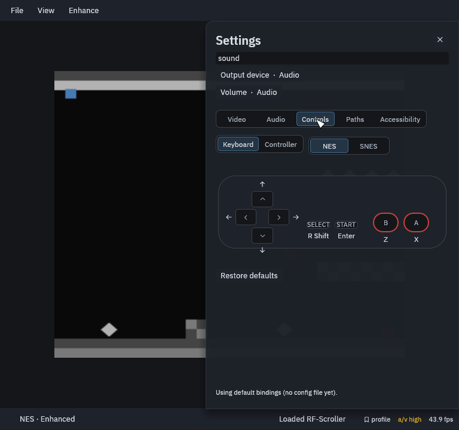
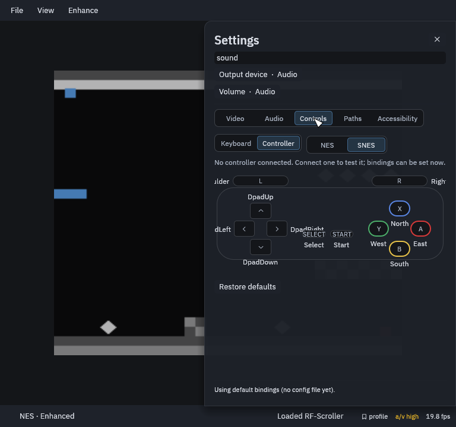

# Controls

Everything works from the keyboard out of the box, and a game controller
works as soon as it is connected. **Quick Menu › Controls** shows the pad
with every button's key, for the NES or the SNES and the keyboard or a
controller. Click a button on the pad, then press the key you want.

## Keyboard defaults

| Button | NES | SNES |
|---|---|---|
| D-pad | Arrow keys | Arrow keys |
| A | X | X |
| B | Z | Z |
| X | | S |
| Y | | A |
| L / R | | Q / W |
| Start | Enter | Enter |
| Select | Right Shift | Right Shift |

## Shortcuts

| Key | Does |
|---|---|
| Esc | Quick Menu (pauses) |
| F5 / F9 | Save state / Load state |
| Backspace (hold) | Rewind |
| Tab (hold) | Fast-forward |
| F11 | Fullscreen |
| F12 | Screenshot |
| F10 | Record video |
| ` (hold) | Peek at the original picture |

In the Quick Menu the arrow keys move, **→** enters a section and **Enter**
selects; with a controller, A selects, B goes back and the shoulder buttons
switch sections.

