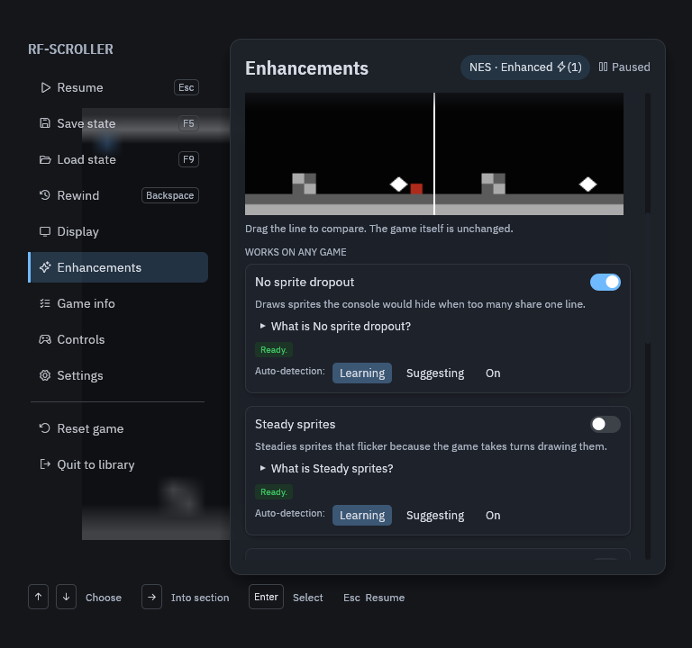

# Modes and enhancements

Every game runs in one of three modes, chosen per game under **Quick Menu ›
Enhancements**. The game itself always runs the same way; modes only change
what is drawn on top of it.

| Mode | What you get |
|---|---|
| **Original** | Exactly what the console drew. Nothing added. The default. |
| **Enhanced** | Fixes that work on any game: no sprite dropout, steady sprites instead of flicker, shaders. |
| **Game-Aware** | Uses this game's profile to widen the picture, map whole levels, skip loading and build them in 3D. |

Each feature says why it is or is not available: it may need a mode, a
profile for this game, or something the game has to be doing (Mode 7 in 3D
needs a Mode 7 scene). The comparison slider underneath shows the original
and what you see side by side.

## Display

**Quick Menu › Display** sizes the picture (the default fits the game
exactly, with no black borders), applies shaders such as CRT, and adds an
ambient glow or a bezel around the picture.

| | |
|---|---|
|  |  |

## What a profile unlocks

With a matched profile, Game-Aware mode can stitch the level as you play
and show the whole map:

