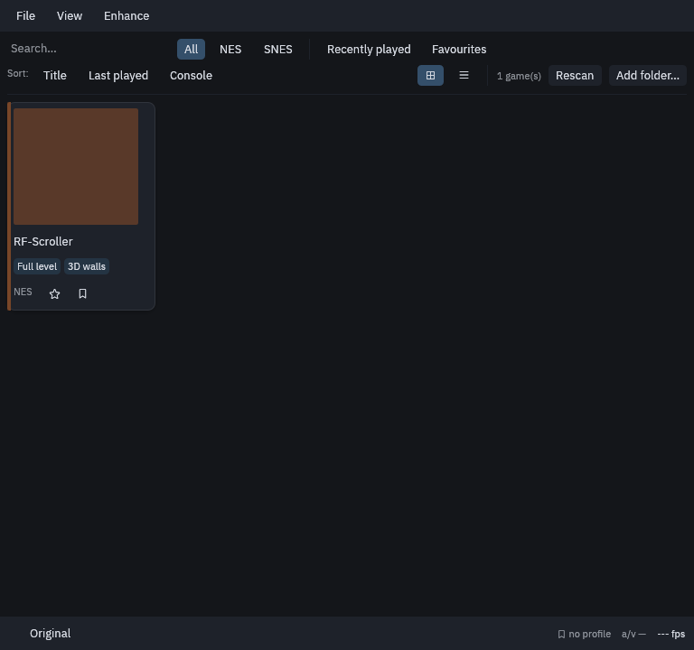
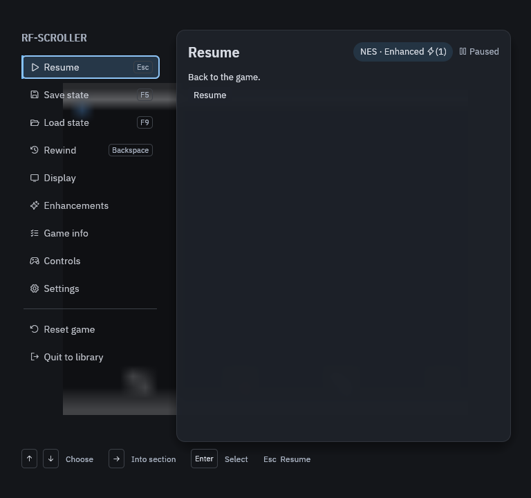

# Getting started

RetroForge plays NES and SNES games you already own. It ships no games and
downloads none: you point it at your own copies.

## Install

Download the macOS build from the release page and run `retroforge`. A
fresh install starts in **Original** mode, which shows exactly what the
console drew, with nothing added.

Windows and Linux builds are not published yet: the project has no
machines to build and test them on.

## Add your games

1. Click **Add folder…** in the library and pick the folder that holds your
   games. Add as many folders as you like.
2. RetroForge reads `.nes`, `.sfc`, `.smc` and `.fig` files, and `.zip` archives
   that contain one.
3. Click a game to play it. **Rescan** picks up games you add later.

The library's chips filter by console, **Recently played** and
**Favourites** (the star on each card). Chips such as **Full level** and
**Widescreen** on a card mean RetroForge has a profile for that exact copy
of the game; see [Game profiles](game-profiles.md).

## While you play

Press **Esc** to open the Quick Menu. It pauses the game; press **Esc**
again to go back to it.

| Section | What it's for |
|---|---|
| Resume | Back to the game |
| Save state / Load state | Ten slots per game, with pictures (F5 / F9) |
| Rewind | Hold **Backspace** while playing to go back in time |
| Display | Size, shaders, fullscreen |
| Enhancements | The mode, and what this game's profile unlocks |
| Game info | Lives, health, coins and more, pinned over the game |
| Controls | Keyboard and controller buttons |
| Settings | Everything else, with search |

Your settings live in `~/Library/Application Support/retroforge`.
